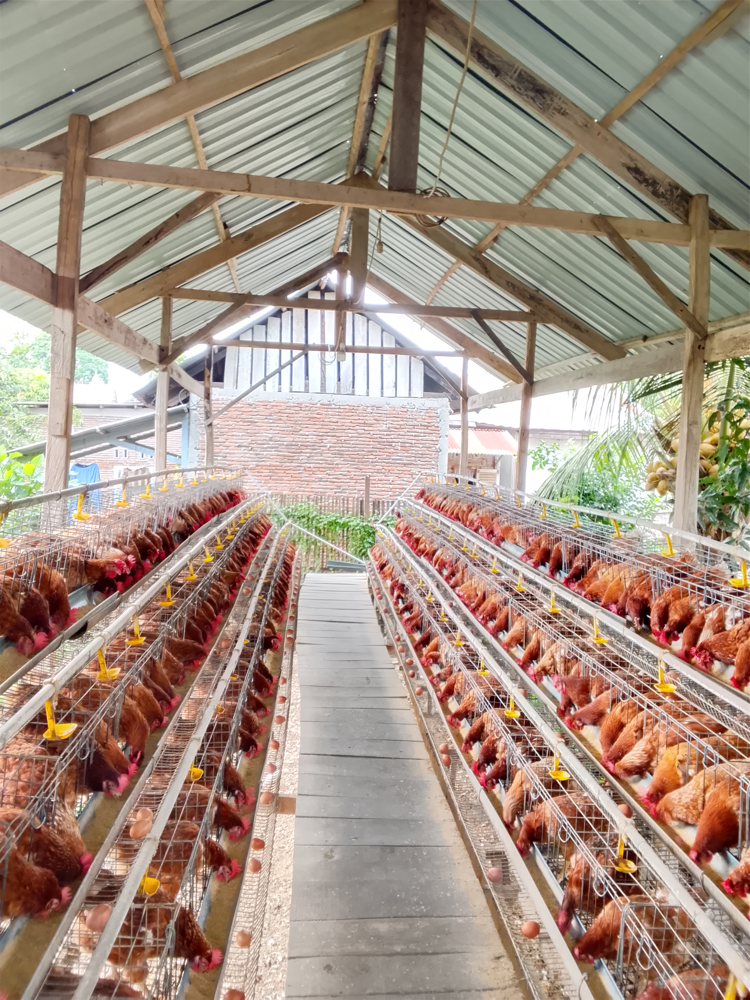

<!DOCTYPE html>
<html lang="id">
<head>
  <meta charset="UTF-8">
  <meta name="viewport" content="width=device-width, initial-scale=1.0">
  <title>Telur Dari Icha</title>

  
</head>

<body>

<header>
  <h1>Telur Dari Icha</h1>
  
Peternakan Ayam Petelur · Kota Bantaeng

</header>

<nav>
  <a href="#tentang">Tentang Kami</a>
  <a href="#produk">Produk</a>
  <a href="#kontak">Kontak</a>
</nav>

<section id="tentang">
  
  <h2>Tentang Kami</h2>
  

    <strong>Telur Dari Icha</strong> adalah peternakan ayam petelur yang berlokasi di Kota Bantaeng.
    Kami menyediakan telur ayam negeri segar, bersih, dan berkualitas
    yang dipanen setiap hari langsung dari kandang.
  

  

    Telur ayam negeri kaya protein, vitamin, dan mineral
    yang baik untuk pertumbuhan, energi, dan pemenuhan gizi keluarga.
  

</section>
<section id="testimoni">
  <h2>Testimoni Pelanggan</h2>

  

    

      “Telurnya selalu segar dan bersih. Pelayanan cepat dan ramah.
      Sangat cocok untuk kebutuhan warung saya.”
    

    <strong>— Ibu Rina, Warung Sembako</strong>
  

  

    

      “Sudah langganan beli telur grosir di sini.
      Kualitas konsisten dan harga bersahabat.”
    

    <strong>— Pak Andi, UMKM Kue</strong>
  

  

    

      “Telur besar, kuningnya bagus, anak-anak suka.
      InsyaAllah terus beli di sini.”
    

    <strong>— Ibu Sari, Ibu Rumah Tangga</strong>
  

</section>

<section id="produk">
  <h2>Produk Kami</h2>

  

    <h3>🥚 Telur Ayam Eceran</h3>
    
Cocok untuk kebutuhan rumah tangga dan pembelian harian.

  

  

    <h3>📦 Telur Ayam Grosir</h3>
    
Untuk warung, UMKM, dan pembelian dalam jumlah besar.

  

</section>

<section id="kontak">
  <h2>Hubungi Kami</h2>
  
📍 Kota Bantaeng

  
📞 WhatsApp: +62 895-3286-99002

  <a class="wa" href="https://wa.me/62895328699002" target="_blank">
    Hubungi via WhatsApp
  </a>
</section>

<footer>
  
© 2025 Telur Dari Icha · Peternakan Ayam Petelur

</footer>

</body>
</html>
